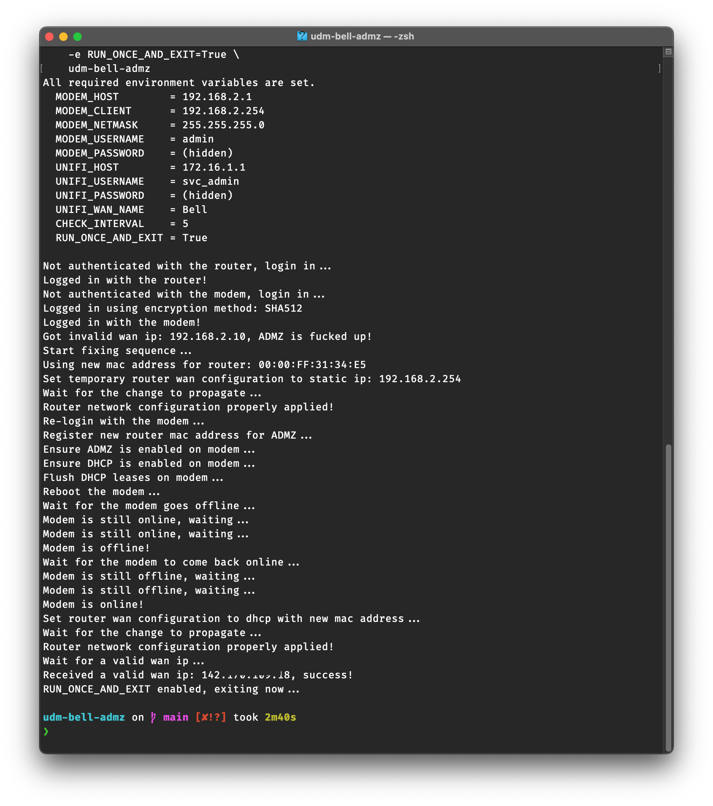

# UDM-Bell-ADMZ

**Self-hosted Python application to fix ADMZ issues between routers and Bell GigaHub modems.**

## Introduction

`UDM-Bell-ADMZ` addresses a long-standing Advanced-DMZ (ADMZ) issue experienced when connecting any router to a Bell GigaHub modem via the 10Gbps LAN port. When the modem reboots, it sometimes hands out an internal IP address instead of a public WAN address, causing double NAT issues.

*Note:* This has been tested with GigaHub/HomeHub 4000 modems and UDM-SE routers. It may work with similar models, but results may vary.

### Common Workarounds

1. **Hope the modem doesn't reboot:** Use a UPS and hope for stability — unreliable.
2. **Use PPPoE Passthrough:** Requires a router with sufficient CPU to handle PPPoE overhead, which may not be viable with high-speed fiber connections.
3. **Accept double NAT:** Live with an internal IP and double NAT.

### How UDM-Bell-ADMZ Fixes the Issue

When the router detects it has received an internal IP address, the following steps are performed automatically:

- **[Router]** Generate a random MAC address for the WAN interface.
- **[Router]** Set WAN interface to a static IP.
- **[Modem]** Set the new MAC address for ADMZ.
- **[Modem]** Enable ADMZ and DHCP.
- **[Modem]** Flush DHCP leases.
- **[Modem]** Reboot.
- **Wait** for the reboot to complete.
- **[Router]** Revert WAN interface to DHCP.

After these steps, your router will correctly obtain a public IP address.
[](screenshots/screenshot.png)

## Installation and Usage

### Clone and Build the Docker Image

```bash
# Clone the repository
git clone https://github.com/jujubosc/udm-bell-admz.git
cd udm-bell-admz

# Build the Docker image
docker build -t udm-bell-admz .
```

### Run the Container

```bash
docker run --rm -it \
   -e MODEM_HOST=192.168.2.1 \
   -e MODEM_CLIENT=192.168.2.254 \
   -e MODEM_PASSWORD=secretpassword \
   -e UNIFI_HOST=172.16.1.1 \
   -e UNIFI_USERNAME=admin \
   -e UNIFI_PASSWORD=secretpassword \
   -e UNIFI_WAN_NAME=WAN \
   udm-bell-admz
```

## Environment Variables

| Variable            | Default Value       | Required | Description                                |
|----------------------|---------------------|----------|--------------------------------------------|
| `MODEM_HOST`        | `192.168.2.1`       | No       | IP address of the modem.                   |
| `MODEM_CLIENT`      | `192.168.2.254`     | No       | Temporary IP for the router.               |
| `MODEM_NETMASK`     | `255.255.255.0`     | No       | Netmask for the modem.                     |
| `MODEM_USERNAME`    | `admin`            | No       | Username for modem login.                  |
| `MODEM_PASSWORD`    | (None)             | Yes      | Password for modem login.                  |
| `UNIFI_HOST`        | (None)             | Yes      | IP address of the router.                  |
| `UNIFI_USERNAME`    | (None)             | Yes      | Username for router login.                 |
| `UNIFI_PASSWORD`    | (None)             | Yes      | Password for router login.                 |
| `UNIFI_WAN_NAME`    | (None)             | Yes      | Name of WAN interface (typically WAN).     |
| `RUN_ONCE_AND_EXIT` | `False`            | No       | Run once and exit if `True`.                |
| `CHECK_INTERVAL`    | `60`               | No       | Interval between checks (seconds).         |

### Required Variables

- `MODEM_PASSWORD`
- `UNIFI_HOST`
- `UNIFI_USERNAME`
- `UNIFI_PASSWORD`
- `UNIFI_WAN_NAME`

## Contributing

Feel free to open issues or submit pull requests to improve `UDM-Bell-ADMZ`.

## Credits

- [python-sagemcom-api](https://github.com/iMicknl/python-sagemcom-api): Used as the base for the ModemClient and modified for HH4400 and ADMZ options.

## License

This project is licensed under the WTFPL License.

**Happy Networking! 🚀**